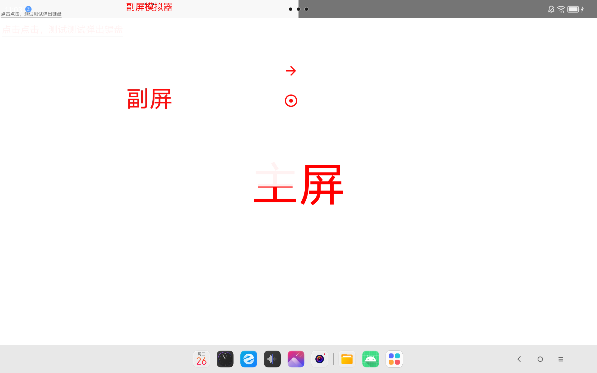

**SecondaryScreen** 一款简单好用的副屏模拟器

# 背景

最近几年新能源电车大火，华为等不少厂商推出了副驾屏，不少车机应用开始支持副驾屏，用以实现主副屏联动。

同时，多屏联动也可以用于以下场景：
* 酒店登记：酒店员工通过一个屏幕操作，顾客通过另一个屏幕查看相关登记信息。
* 超市收银：超市收银员通过一个屏幕操作，顾客通过另一个屏幕查看相关收银信息。
* 演示文稿：演示者可以在一个屏幕上播放要演示的文稿，同时在另一个屏幕上显示备注。
* 多屏协同：多个屏幕连接在一起，每个屏幕可以显示不同的内容，提高多任务处理效率。

通过[AndroidStido模拟器](doc/AndroidStudio模拟器.md)和[模拟辅助显示设备](doc/模拟辅助显示设备.md)可以了解到，overlay方式永远有一个叠加屏遮盖，而且大部分电脑屏幕不是触摸屏，无法响应多指触摸事件，同时部分设备无法弹出软键盘等问题。因此此项目旨在解决上述问题。

# 目标

支持单指、多指触摸，可弹出软键盘，无遮盖（或者可隐藏），可scrcpy映射。

# 简介

## app -- OverlayWindow APP

模仿Android系统的“模拟辅助显示设备”，可放大缩小悬浮窗，扩展了：锁定悬浮窗（操作内部surface），隐藏（最小化）悬浮窗等功能。发送实时触摸事件给server，接受video编码后的数据，通过MediaCodec将video解码，将video渲染到悬浮窗surface上。

## sample -- SecondaryScreenSample APP

模拟开发项目，主屏幕上显示“主屏”字样，副屏幕上显示“副屏”字样，还提供了触摸拖动文字功能。

## server -- OverlayWindow APP‘s server

通过反射方式创建一个virtualdisplay，此virtualdisplay的surface是一个ImageReader创建的surface，因此主屏上无任何副屏相关的渲染内容。接收实时触摸事件，修改displayId后完成事件注入以响应OverlayWindow APP中触发的触摸事件，通过MediaCodec将video编码，推送给OverlayWindow APP，以完成video渲染。

目前server已集成到OverlayWindow APP，server也可以独立运行，具体方式参考[jar包操作步骤](doc/jar包操作步骤.md)

# 注意事项

因Google从Android 10开始才支持带displayId的事件注入，因此此模拟器仅支持Android 10及以上机型。

Android 10 ～ 12设备上创建virtualdisplay后，APP可以识别到virtualdisplay，但是在通过指定displayId拉起activity时会报权限错误。 可以通过am start命令拉起activity，此时模拟器就无法覆盖到APP正常拉起activity的逻辑，此时需要配置firstActivity和secondActivity的名称。

Android 13及以上设备上创建virtualdisplay后，APP可以识别到virtualdisplay，在通过指定displayId拉起activity时可正常拉起activity，无任何权限问题，因此极力推荐使用Android 13及以上设备。

Android 10及以上设备可以通过adb tcpip 5555开启ADB WIFI调试，APP内部通过输入端口号进行连接，连接成功后APP具有ADB shell权限，APP可以直接启动server。

Android 11及以上设备支持ADB WLAN调试，APP内部可以通过输入6位配对码和端口号进行配对，配对成功后APP具有ADB shell权限，APP可以直接启动server。

# 操作

## 电脑充当副屏

1. 手动加载server-jar包或OverlayWindow APP连接/配对ADB调试启动server
2. scrcpy --display-id=?

## Android设备悬浮窗充当副屏

1. OverlayWindow APP连接/配对ADB调试启动server

# 感谢

特别感谢[scrcpy](https://github.com/Genymobile/scrcpy)，给了我诸多灵感。

# License

Copyright 2024 &copy; 苏明白

Dual licensed under the terms of [Apache-2.0 license](https://www.apache.org/licenses/LICENSE-2.0.html). 
