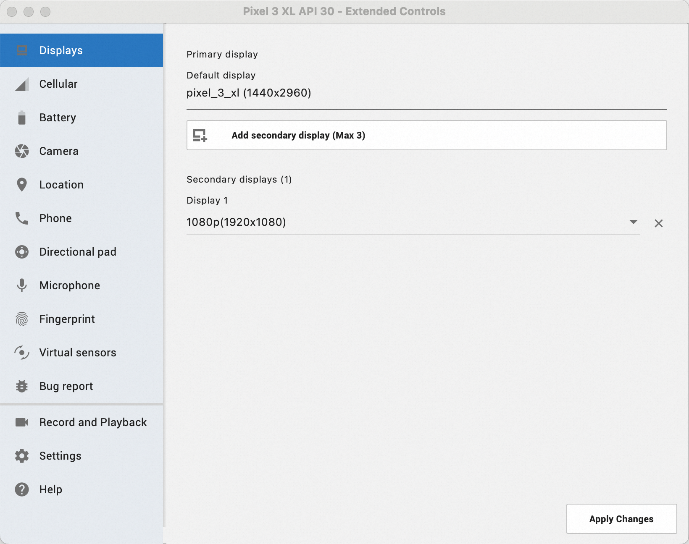
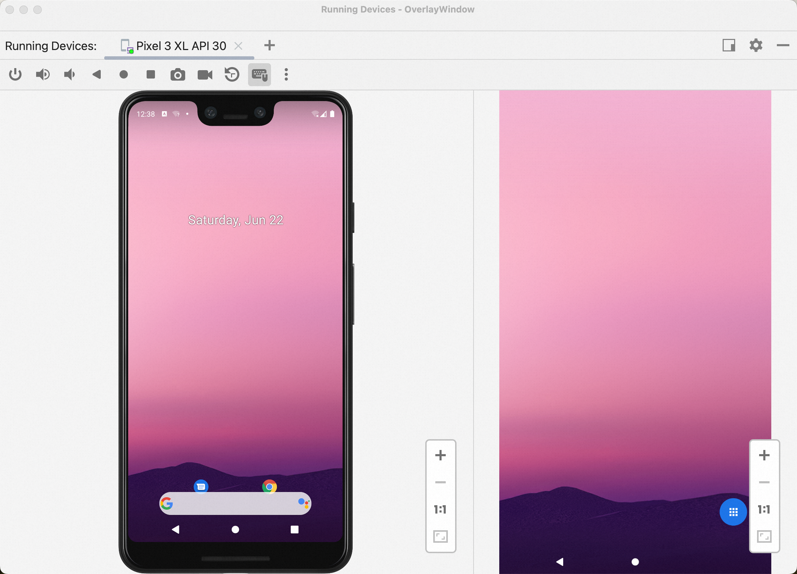

# AndroidStudio模拟器

利用Android Studio创建完虚拟设备之后可以在Display设置项里通过“Add secondary display”新增第二块显示屏。



可以通过`dumpsys display | grep mBaseDisplayInfo=DisplayInfo`命令查看当前已创建的副屏信息。

```shell
% adb shell dumpsys display | grep mBaseDisplayInfo=DisplayInfo
  mBaseDisplayInfo=DisplayInfo{"Emulator 2D Display", displayId 2, displayGroupId 0, FLAG_PRESENTATION, FLAG_SHOULD_SHOW_SYSTEM_DECORATIONS, FLAG_TRUSTED, real 1080 x 1920, largest app 1080 x 1920, smallest app 1080 x 1920, appVsyncOff 0, presDeadline 16666666, mode 260.0, defaultMode 2, modes [{id=2, width=1080, height=1920, fps=60.0, alternativeRefreshRates=[], supportedHdrTypes=[]}], hdrCapabilities null, userDisabledHdrTypes [], minimalPostProcessingSupported false, rotation 0, state ON, committedState UNKNOWN, type VIRTUAL, uniqueId "virtual:com.android.emulator.multidisplay:1234562", app 1080 x 1920, density 320 (320.0 x 320.0) dpi, layerStack 2, colorMode 0, supportedColorModes [0], deviceProductInfo null, owner com.android.emulator.multidisplay (uid 1000), removeMode 0, refreshRateOverride 0.0, brightnessMinimum 0.0, brightnessMaximum 0.0, brightnessDefault 0.0, installOrientation ROTATION_0, layoutLimitedRefreshRate null, hdrSdrRatio not_available, thermalRefreshRateThrottling {}, thermalBrightnessThrottlingDataId default}
```

此副屏type为VIRTUAL。



# AndroidStudio模拟器创建的副屏存在的问题

此方式创建的虚拟屏依赖于电脑环境，即搭建的Android系统体系结构依赖于电脑本身的体系结构，且比较吃电脑资源。而大部分电脑屏幕是非触摸屏，只可以用鼠标进行操作，鼠标只能模拟单指，无法模拟出双指、多指操组。