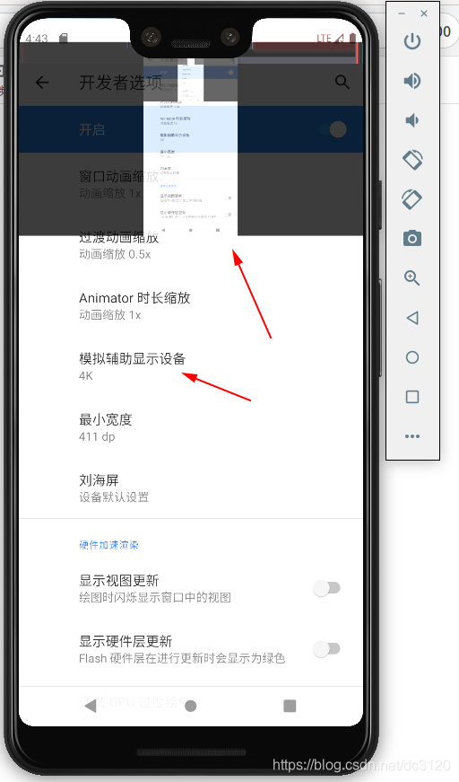
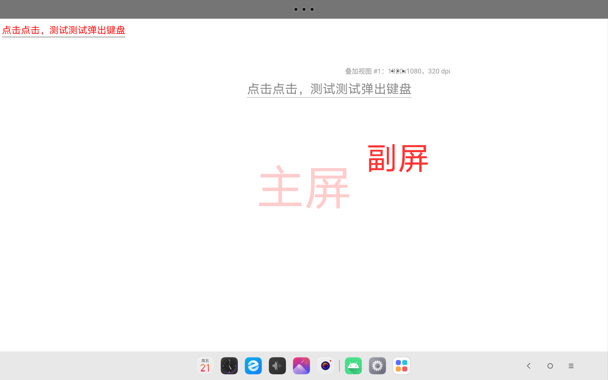

# 模拟辅助显示设备

Android开发者选项中有一个“模拟辅助显示设备”配置项，可模拟一个副屏。



开启“模拟辅助显示设备”后，可以通过`dumpsys display | grep mBaseDisplayInfo=DisplayInfo`命令查看当前已创建的副屏信息。

```shell
% adb shell dumpsys display | grep mBaseDisplayInfo=DisplayInfo
    mBaseDisplayInfo=DisplayInfo{"内置屏幕", displayId 0", displayGroupId 0, FLAG_SECURE, FLAG_SUPPORTS_PROTECTED_BUFFERS, FLAG_TRUSTED, real 1200 x 1920, largest app 1200 x 1920, smallest app 1200 x 1920, appVsyncOff 1000000, presDeadline 17111110, mode 1, defaultMode 1, modes [{id=1, width=1200, height=1920, fps=90.0, alternativeRefreshRates=[]}], hdrCapabilities HdrCapabilities{mSupportedHdrTypes=[2, 3], mMaxLuminance=500.0, mMaxAverageLuminance=500.0, mMinLuminance=0.0}, userDisabledHdrTypes [], minimalPostProcessingSupported false, rotation 0, state ON, type INTERNAL, uniqueId "local:4630946861623396481", app 1200 x 1920, density 240 (207.346 x 207.523) dpi, layerStack 0, colorMode 0, supportedColorModes [0, 7, 9], address {port=129, model=0x40446da284c5c8}, deviceProductInfo DeviceProductInfo{name=, manufacturerPnpId=QCM, productId=1, modelYear=null, manufactureDate=ManufactureDate{week=27, year=2006}, connectionToSinkType=0}, removeMode 0, refreshRateOverride 0.0, brightnessMinimum 0.0, brightnessMaximum 1.0, brightnessDefault 0.5, installOrientation ROTATION_0}
    mBaseDisplayInfo=DisplayInfo{"叠加视图 #1", displayId 5", displayGroupId 0, FLAG_PRESENTATION, FLAG_TRUSTED, real 1920 x 1080, largest app 1920 x 1080, smallest app 1920 x 1080, appVsyncOff 0, presDeadline 28222221, mode 5, defaultMode 5, modes [{id=5, width=1920, height=1080, fps=90.0, alternativeRefreshRates=[]}], hdrCapabilities null, userDisabledHdrTypes [], minimalPostProcessingSupported false, rotation 0, state ON, type OVERLAY, uniqueId "overlay:1", app 1920 x 1080, density 320 (320.0 x 320.0) dpi, layerStack 5, colorMode 0, supportedColorModes [0], deviceProductInfo null, removeMode 0, refreshRateOverride 0.0, brightnessMinimum 0.0, brightnessMaximum 0.0, brightnessDefault 0.0, installOrientation ROTATION_0}
```

主屏幕的displayId为0，副屏幕的displayId为5。

副屏叠加在主屏上，可以放大缩小，也可以移动，但不可隐藏与操作。

可通过神器[scrcpy](https://github.com/Genymobile/scrcpy)映射并操作副屏，注意：Android 10及以上机型才支持触摸事件。

通过`scrcpy --list-display`查看副屏。

```shell
% scrcpy --list-display
scrcpy 2.4 <https://github.com/Genymobile/scrcpy>
INFO: ADB device found:
INFO:     -->   (usb)  HA1XPP94                        device  TB331FC
/usr/local/Cellar/scrcpy/2.4/share/scrcpy/scrcpy-server: 1 file pushed, 0 skipped. 28.2 MB/s (69007 bytes in 0.002s)
[server] INFO: Device: [LENOVO] Lenovo TB331FC (Android 13)
[server] INFO: List of displays:
    --display-id=0    (1200x1920)
    --display-id=5    (1920x1080)
```

通过`scrcpy --list-display`映射并操作副屏。

```shell
% scrcpy --display-id=5
scrcpy 2.4 <https://github.com/Genymobile/scrcpy>
INFO: ADB device found:
INFO:     -->   (usb)  HA1XPP94                        device  TB331FC
/usr/local/Cellar/scrcpy/2.4/share/scrcpy/scrcpy-server: 1 file pushed, 0 skipped. 50.2 MB/s (69007 bytes in 0.001s)
[server] INFO: Device: [LENOVO] Lenovo TB331FC (Android 13)
[server] WARN: Display doesn't have FLAG_SUPPORTS_PROTECTED_BUFFERS flag, mirroring can be restricted
INFO: Renderer: metal
INFO: Texture: 1920x1080
```



开发者选项-模拟辅助显示设备中提供的副屏分辨率有限，我们可通过shell命令指定任意分辨率。

shell命令创建一块副屏

```shell
$settings put global overlay_display_devices "WxH/DENSITY"
```

shell命令创建多块副屏（最多6块），注意携带secure参数时无法截屏、录屏。

```shell
$settings put global overlay_display_devices "WxH/DENSITY,secure;WxH/DENSITY,secure"
```

shell命令删除副屏

```shell
$settings put global overlay_display_devices "null"

$settings put global overlay_display_devices ""

$settings delete global overlay_display_devices
```

部分手机无法弹出软键盘，可通过打开Android手机开发者模式中的“绘图-强制桌面模式“解决，或者使用电脑键盘代替。

shell命令也可打开、关闭强制桌面模式。

查看强制桌面模式

```shell
$settings get global force_desktop_mode_on_external_displays
```

打开强制桌面模式

```shell
$settings put global force_desktop_mode_on_external_displays 1
```

关闭强制桌面模式

```shell
$shell settings put global force_desktop_mode_on_external_displays 0
```

# scrcpy映射副屏存在的问题

scrcpy映射副屏方案能够解决大部分问题，但大部分电脑屏幕是非触摸屏，只可以用鼠标进行操作，鼠标只能模拟单指，无法模拟出双指、多指操组。且系统Overlay方式始终在主屏上有一个遮盖的叠加窗，这个叠加窗无法操作，更无法隐藏，因此在手机上开发一个可操作可隐藏的自定义悬浮窗迫在眉睫。
